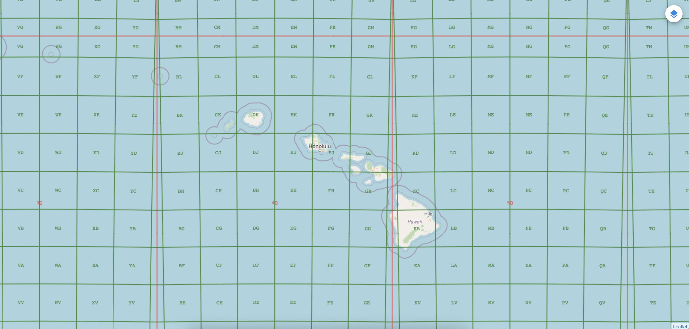

# MGRS Javascript



#### Military Grid Reference System Lib

The MGRS Library was developed at the
[National Geospatial-Intelligence Agency (NGA)](http://www.nga.mil/) in
collaboration with [BIT Systems](https://www.caci.com/bit-systems/). The
government has "unlimited rights" and is releasing this software to increase the
impact of government investments by providing developers with the opportunity to
take things in new directions. The software use, modification, and distribution
rights are stipulated within the
[MIT license](http://choosealicense.com/licenses/mit/).

### About

[MGRS](http://ngageoint.github.io/mgrs-js/) is a Javascript library providing
Military Grid Reference System functionality, a geocoordinate standard used by
NATO militaries for locating points on Earth.

#### Coordinates

```typescript
const mgrs = MGRS.parse("33XVG74594359");
const point = mgrs.toPoint();
const pointMeters = point.toMeters();
const utm = mgrs.toUTM();
const utmCoordinate = utm.toString();
const point2 = utm.toPoint();

const mgrs2 = MGRS.parse("33X VG 74596 43594");

const latitude = 63.98862388;
const longitude = 29.06755082;
const point3 = Point.point(longitude, latitude);
const mgrs3 = MGRS.from(point3);
const mgrsCoordinate = mgrs3.toString();
const mgrsGZD = mgrs3.coordinate(GridType.GZD);
const mgrs100k = mgrs3.coordinate(GridType.HUNDRED_KILOMETER);
const mgrs10k = mgrs3.coordinate(GridType.TEN_KILOMETER);
const mgrs1k = mgrs3.coordinate(GridType.KILOMETER);
const mgrs100m = mgrs3.coordinate(GridType.HUNDRED_METER);
const mgrs10m = mgrs3.coordinate(GridType.TEN_METER);
const mgrs1m = mgrs3.coordinate(GridType.METER);

const utm2 = UTM.from(point3);
const mgrs4 = utm2.toMGRS();

const utm3 = UTM.parse("18 N 585628 4511322");
const mgrs5 = utm3.toMGRS();
```

#### Draw Tile Template

See [mgrs-android](https://github.com/ngageoint/mgrs-android) for a concrete
example

```typescript
// GridTile tile = ...;

const grids = Grids.create();

const zoomGrids = grids.getGrids(tile.getZoom());
if (zoomGrids && zoomGrids.hasGrids()) {
  const gridRange = GridZones.getGridRange(tile.getBounds()!);

  for (const grid of zoomGrids) {
    // draw this grid for each zone
    for (const zone of gridRange) {
      const lines = grid.getLinesFromGridTile(tile, zone);
      if (lines) {
        const pixelRange = zone.getBounds().getPixelRangeFromTile(tile);
        for (const line of lines) {
          const pixel1 = line.getPoint1().getPixelFromTile(tile);
          const pixel2 = line.getPoint2().getPixelFromTile(tile);
          // Draw line
        }
      }

      const labels = grid.getLabelsFromGridTile(tile, zone);
      if (labels) {
        for (const label of labels) {
          const pixelRange = label.getBounds()?.getPixelRangeFromTile(tile);
          const centerPixel = label.getCenter()?.getPixelFromTile(tile);
          // Draw label
        }
      }
    }
  }
}
```
